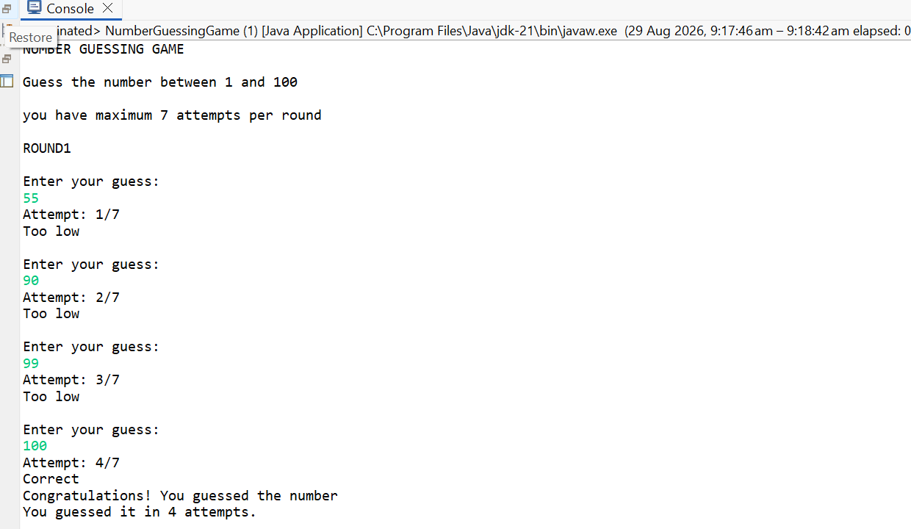
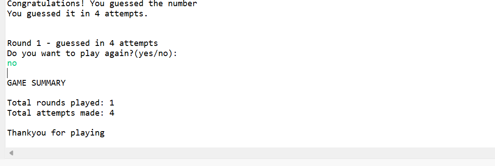
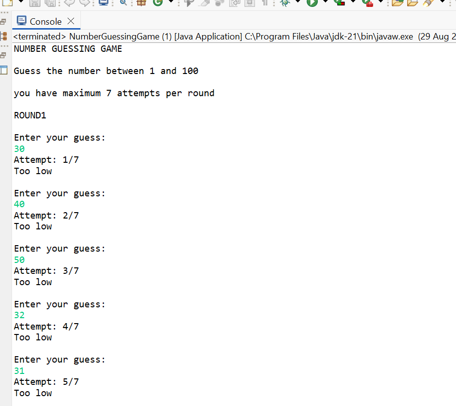
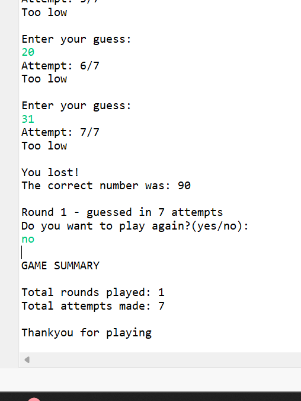

# Number Guessing Game

## Description
A simple Java console-based Number Guessing Game developed as part of the OIBSIP Java Development Internship.

The program generates a random number, and the user tries to guess the number. The program provides feedback for each guess until the correct number is found.

## Technologies Used
- Java
- Java Scanner
- Java Random

## Features
- Generates a random number
- Accepts user guesses
- Provides feedback for incorrect guesses
- Continues until the correct number is guessed
- Displays the successful game result

## Project Structure

Java-Task2-NumberGuessingGame/
- src/com/oasisinfobyte/numberguessing/NumberGuessingGame.java
- Screenshots/
- README.md

## Screenshots

### Successful Game

### Game Over

## Internship
OIBSIP - Oasis Infobyte Java Development Internship

## Author
Chandana Reddy
